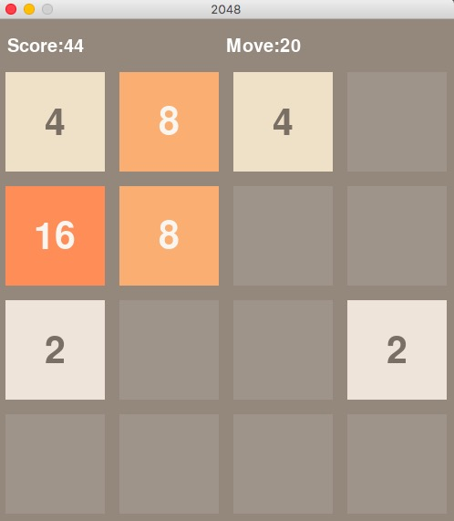
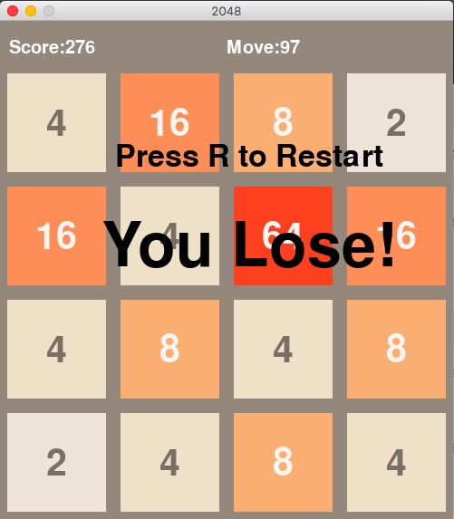

# 2048 Game
Based on the popular game [2048](https://github.com/gabrielecirulli/2048) by Gabriele Cirulli.<br>
It is just a implementation with pygame<br>

<br>
## Usage
Dependency: pygame, numpy<br>
Install requirement```pip install -r requirements.txt ``` <br>
Just run ```python game_board.py``` to run the game

## Description
Using arrow key to control the game<br>
Press "r" to restart<br>

<br>
Used pygame to create the board, and including a simple game_logic file to detect the game state(weather we have lost the game or not)
and a simple board to vistualize the game. <br>
Scores are calculated by the eliminated blocks, and moves stands for the moves currently

